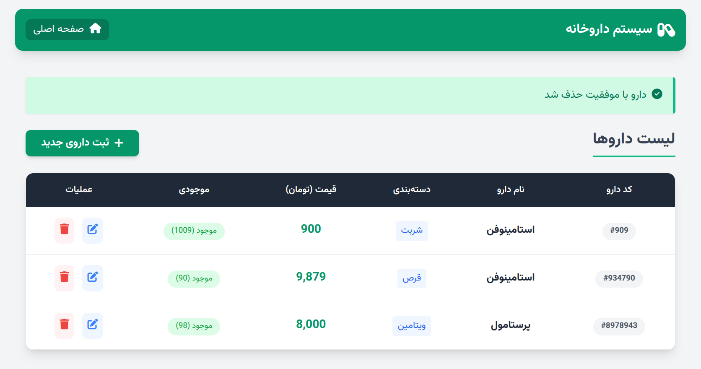
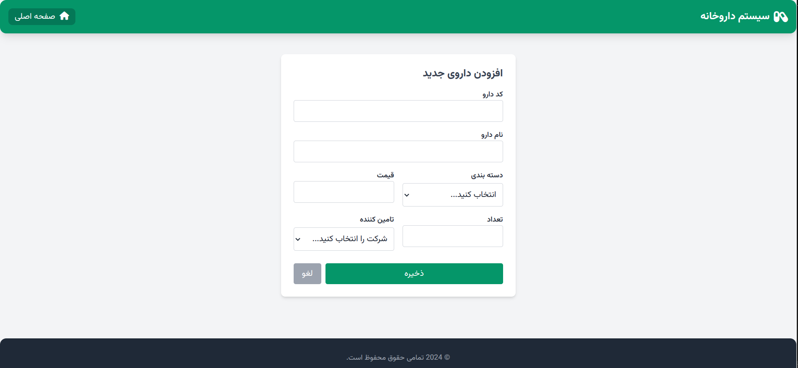
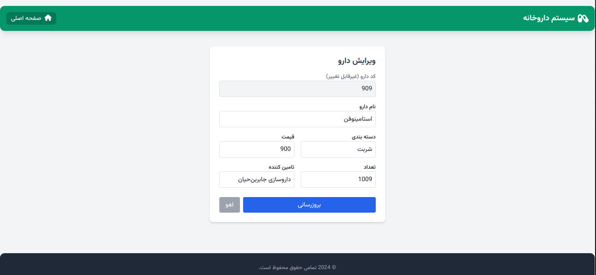

# 🏥 CRUD Excercise With Php

<div align="center">


<br>

**🚀 A Modern, Secure, and Containerized Inventory Management.**

Built with **Pure PHP (MVC Architecture)** and styled with **Tailwind CSS**.  
*Say goodbye to spaghetti code and hello to clean architecture!* 🍝➡️💎

[Report Bug](https://github.com/nadimnikzai/crud_mvc_php_dockerized.git/issues) · [Request Feature](https://github.com/nadimnikzai/crud_mvc_php_dockerized.git/issues)

</div>

---

## 🌟 Features

Why is this project cool? Check this out:

* **🏗️ MVC Architecture:** Clean separation of concerns (Model, View, Controller). Professional & Scalable.
* **🐳 Dockerized:** Runs everywhere! No more "It works on my machine" excuses.
* **🎨 Modern UI:** Beautiful, responsive interface built with **Tailwind CSS**.
* **🔒 Secure:** Prevents SQL Injection using **PDO Prepared Statements**.
* **⚡ Fast & Lightweight:** No heavy frameworks, just pure, optimized PHP code.
* **🛠️ CRUD Operations:**
    * ✅ **C**reate new drugs (with categories & suppliers).
    * 👀 **R**ead & Search inventory instantly.
    * ✏️ **U**pdate drug details.
    * 🗑️ **D**elete items safely.

---

## 🛠️ Tech Stack

| Component | Technology | Description |
| :--- | :--- | :--- |
| **Backend** |  | Core logic with MVC pattern |
| **Database** |  | Relational Database Management |
| **Frontend** |  | Utility-first CSS framework |
| **DevOps** |  | Containerization & Orchestration |
| **Tools** |  | Version Control |

---

## 🚀 Quick Start (Docker)

You don't need XAMPP or WAMP. You just need **Docker**!

### 1. Clone the Repository
```bash
git clone https://github.com/nadimnikzai/crud_mvc_php_dockerized.git
cd drugs_database
```
2. Run with Docker Compose 🐳
Fire up the engines:

Bash
``` bash
docker-compose up -d --build
```
Wait a few moments for the containers to build and start...

3. Access the App 🌐
Open your browser and visit:

App: http://localhost:8080

PhpMyAdmin: http://localhost:8081 (User: root, Pass: root)

📂 Project Structure
Look at this clean structure! 😍

drugs_database/
├── config/             # Database connection (Singleton/PDO)
├── controllers/        # Business logic (Brain of the app) 🧠
├── views/              # HTML & Tailwind templates 🎨
│   ├── partials/       # Reusable headers/footers
├── docker-compose.yml  # Docker orchestration
├── Dockerfile          # Server configuration
├── index.php           # Entry point (Router)
└── README.md           # You are reading this!

## 🖼️ Screenshots

Here is a glimpse of the application:

### Dashboard & Inventory


### Add New


### Edit

Note: This project is designed for educational purposes to demonstrate MVC and Docker implementation in PHP.

🤝 Contributing
Contributions, issues, and feature requests are welcome!

Feel free to check the issues page.

Fork the Project

Create your Feature Branch (git checkout -b feature/AmazingFeature)

Commit your Changes (git commit -m 'Add some AmazingFeature')

Push to the Branch (git push origin feature/AmazingFeature)

Open a Pull Request

✍️ Author
👤 Nadim Nikzai

Github: @nadimnikzai

<div align="center"> Show some ❤️ by starring ⭐ this repository! </div>
